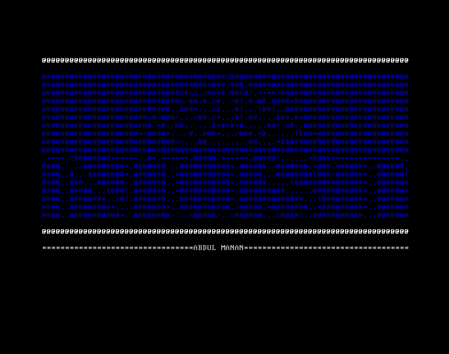

This project is assigned as a course assignment for Computer Organization and Assembly. I made 64-bit operating system using the following given resources/tutorials.  
* [Write Your Own 64-bit Operating System Kernel #1 - Boot code and multiboot header](https://www.youtube.com/watch?v=FkrpUaGThTQ)
* [Write Your Own 64-bit Operating System Kernel #2 - Stack, long mode and printing using C code](https://www.youtube.com/watch?v=wz9CZBeXR6U)  

**Github Repo of the code: [https://github.com/abdulmanann/operating-system-assignment](https://github.com/abdulmanann/operating-system-assignment)**  

### Software, Packages and Languages   
The softwares, packages and languages used were
* *Docker* - for accessing pre-built images used in the project
* *Qemu* - to emulate hardware for running the operating system
* *Grub* - bootloader package
* *gcc-cross-x86_64* - a package to compile the code
* *VS Code* - text editor to write code   
* *C language* - to write functions for displaying message on screen.
* *NASM* - to assemble the assembly code.
  
### Project Explaination

The operating system is made for x86 architecure and the bootloader is multiboot complaint; that is it can run with other operating system. It is written in assembly and C language. I first created 32-bit mode compatible operating system than using paging implemented the virtual memory and thus switched the mode to 64-bit mode.

#### Setting up the environment
The docker file contains all the required packages to build our image for the environment required for the operating system. It is built upon another pre-built image. Using the environment, we will be in virtual linux machine where we will have access to all the required tools.

#### Integrating bootloader and creating entry point
The implementation folder includes the assembly code. We have boot folder that integrates bootloader to the operating system. Inside, the folder you will find asm files. The header.asm file contains magic data; its a number that the bootloader will look for so that it can understand that we have an operating system. The bootloader is the first thing that starts on a computer, its core responsibilty is to locate an operating system. This project follows multiboot 2 specifications. It is supported by most bootloaders. The Multiboot 2 specification supports boot modules, which are pieces of data loaded into memory when the bootloader boots your kernel. The header file also contains information about the architecure on which our operating system would run.  
The main.asm file is the entry point into the operating system. In part 01, to print something on screen, we write directly to video memory. The cpu will show this stored information on our screen. Video memory is memory on a video card and in some cases on the motherboard, that's accessible by the video and computer processor. Using mov instruction we moved the data to be printed to the address of video memory. 

#### Creating stack, switching to long mode and 64-bit mode
In part 02, a stack is setup to allow us to link to C code. Stack is region in memory that stores functions' call data that includes local variables and address that the function would return to. The stack is coded to be created in main.asm file. 16 KB of memory is reserved for the stack.  
Before linking to C code, the kernel is to be switched into 64-bit mode. For this, the cpu has to be switched to long mode. Few functions are written in main.asm file to check if the multiboot 2 bootloader has loaded it successfully, and also to check cpu id which is a cpu instruction that provides various cpu information. Using cpu id, we check if the computer supports long mode. Long mode is the mode where a 64-bit operating system can access 64-bit instructions and registers. As a requirement for long mode, we need to implement virtual memory through a process called paging.  
|  | 
|:--:| 
| *Virtual Memory and Paging* |

The data is stored in different physical addresses. However, rather than working with physical addresses in ram, we work with virtual addresses which are maped to the physical addresses. This provides a useful layer of indirection as it benefits in reduced memory fragmentation, memory swapping and copy-on write data. Paging allows us to map virtual address to physical addresses. This is done by creating page tables where we define all the mappings. After enabling the long mode, we create global descriptor table to enter 64-bit mode. It does not serve much purpose as we have used paging but it a requirement for 64-bit mode. The Global Descriptor Table is a table in memory that defines the processor's memory segments.
The main64.asm has code written in 64-bit instruction set and it links the system with the C code. The main64.asm calls a kernel_main function which is written in C language.  

#### Writing C code 
In C code, a custom print function is written. Main.c has a function called kernel_main. It is the function where we use our custom print functions to write anything. The requirement of the assignment was to print the logo of NUST using ascii characters. This is the file where the logo is printed. Print.h is the header file where we define the interface for our print functions. The print.c has definition of all the print functions. It refers the video memory for printing the string. The number of columns and rows are fixed as the video memory can only show 80*25 characters. 

#### Setting up linker and grub configuration
In the targets/x86_64 directory, we have files required to build the operating system for x86 architecture. Here we have linker file that describe how to link our operating system together. In linker file, the entry point and all of the individual sections are defined. In ISO folder, we have grub configuration file and final ISO file. The grub will create an ISO file out of our operating system kernel binary. ISO is a common format for holding operating system. 
In the makefile, we have commands to build our operating system. Make is tool to organize the build commands and it makes sure that the only files with changes be rebuilt.  

|  | 
|:--:| 
| *Output of printed logo* |

